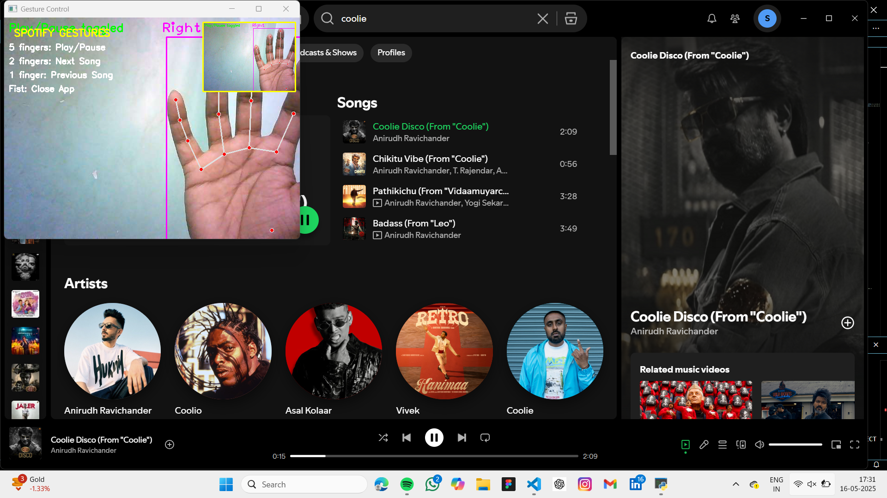
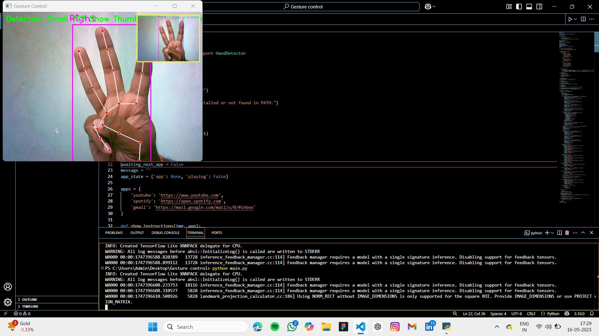

# Gesture-Controlled Virtual Assistant 🤖✋

A computer vision-powered virtual assistant that allows users to control popular applications such as **YouTube**, **Spotify**, and **Gmail** using hand gestures. Built using Python, OpenCV, and the `cvzone` Hand Tracking Module, this project showcases how intuitive gesture interaction can be integrated into desktop workflows.

---

## 🚀 Features

- ✋ **Gesture Detection** using hand landmarks
- 📺 Control **YouTube**:
  - 5 fingers: Play/Pause
  - 2 fingers: 2x speed
  - 4 fingers: Reduce speed (-0.25x)
  - 1 finger: Move cursor
  - Thumb + Index: Click
  - Fist: Close YouTube
- 🎵 Control **Spotify** (desktop app):
  - 5 fingers: Play/Pause
  - 2 fingers: Next song
  - 1 or 3 fingers: Previous song
  - Fist: Close Spotify
- 📧 Navigate **Gmail**:
  - 1 finger: Inbox
  - 2 fingers: Outbox
  - 3 fingers: Spam
  - 5 fingers: Auto-reply mode
  - Thumb + Index: Click
  - Fist: Close Gmail
- 🖱️ Scroll using hand movement up/down
- 🧠 Smart context switching after app close
- 🖼️ Real-time visual instructions overlaid on camera feed

---

## 📷 Demonstration

Here are snapshots of the project in action:

| Gmail Interface | YouTube Interface | Spotify Interface | App Selection |
|------------------|------------------|-------------------|------------------|
|  |  |  |  |

> _Note: Place these images inside a folder named `images/` in your repository._

---

## 🛠️ Tech Stack

- **Python**
- **OpenCV** – for camera access and real-time image processing
- **cvzone** – for simplified hand detection
- **pyautogui** – for desktop automation (keystrokes, cursor movement)
- **subprocess/webbrowser** – to launch applications or websites

---

## 🧠 How it Works

1. Starts webcam and detects hand using landmarks.
2. Recognizes the number of fingers raised and maps them to a gesture.
3. Waits for confirmation (thumbs up) before launching an app.
4. Executes pre-defined gesture commands within the opened app.
5. Shows a mini camera preview + full-screen instructions overlay.
6. Closes app on fist gesture and waits for a new selection.

---

## 🖥️ Getting Started

### 🔧 Prerequisites
- Python 3.7+
- Webcam
- Installed applications (like Spotify Desktop App)

## 🤝 Let's Collaborate!

I'm open to collaboration on data analysis, SQL automation, and media analytics projects.

📧 Email: [saitejhas49@gmail.com](mailto:saitejhas49@gmail.com)  
🔗 LinkedIn: [L.N. Sai Tejhas](https://linkedin.com/in/lnsaitejhas)

---

> Thank you for exploring this project! ⭐ If you found it helpful, consider giving the repo a star!
